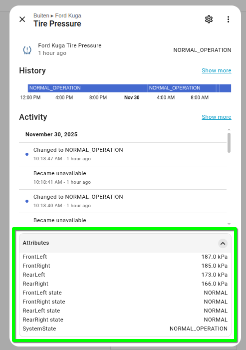
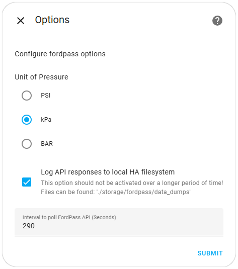

# FordPass Home Assistant Integration 2025 (EV/PHEV/Petrol/Diesel)
## Supporting all Ford vehicles with FordPass™ & Lincoln vehicles with The Lincoln Way™ connectivity

<!--
> [!IMPORTANT]  
> ## New Users: You need version 2025.10.2 or later!
> When you want to initially setup this integration you must use the latest version (2025.10.2 or later) - in any other case you will get no response from the Ford backend, when the integration trying to fetch the access_token ([see Issue #107](https://github.com/marq24/ha-fordpass/issues/107)).
-->

<!--
# IMPORTANT 2025/10/22 - Integration Setup does NOT WORK ANYLONGER

I am sorry to let you know, that Ford have changed once again the initial login procedure to receive a initial ACCESS-Token for a Ford vehicle. This means, that NEW users currently can't setup this integration - since the complete Setup will NOT work.

This was just a question of time, when this will happen - but we will see, IF and WHEN it's possible again to dig a new tunnel though the Ford backends :-/

If you have currently your integration configured, then you might be lucky and this will continue to work... *sigh* - I'll keep you update.
-->

<!--
> [!NOTE]  
> Highlights information that users should take into account, even when skimming.

> [!TIP]
> Optional information to help a user be more successful.

> [!IMPORTANT]  
> Crucial information necessary for users to succeed.

> [!WARNING]  
> Critical content demanding immediate user attention due to potential risks.

> [!CAUTION]
> Negative potential consequences of an action.
-->

[![hacs_badge][hacsbadge]][hacs] [![github][ghsbadge]][ghs] [![BuyMeCoffee][buymecoffeebadge]][buymecoffee] [![buymecoffee2][buymecoffeebadge2]][buymecoffee2] [![PayPal][paypalbadge]][paypal] [![hainstall][hainstallbadge]][hainstall]

> [!WARNING]
> ## General Disclaimer
> **This integration is not officially supported by Ford, and as such, using this integration could have unexpected/unwanted results.**
>
> Please be aware that I am developing this integration to the best of my knowledge and belief, but can't give a guarantee. Therefore, use this integration **at your own risk**! [ _I am not affiliated with Ford in any way._]
>
> ## FordPass™/The Lincoln Way™ Account Disclaimer 
> **The use of this HA integration could lead to a (temporary) lock of your FordPass™/The Lincoln Way™ account.**
> Since this integration is not officially supported by Ford, using it could result in your being locked out! from your account.
>
> **It's recommended** to use/create a **separate FordPass™/The Lincoln Way™ account** for this integration ([see the 'step-by-step' procedure further below](https://github.com/marq24/ha-fordpass?tab=readme-ov-file#use-of-a-separate-fordpassthe-lincoln-way-account-is-recommended)).

---

> [!NOTE]
> Even if this integration was initially forked from [@itchannel and @SquidBytes](https://github.com/itchannel/fordpass-ha), the current version is a complete rewrite and is __not compatible__ with the __original FordPass integration__.
> 
> I have been continuously working on improvements of the integration in the past month, especially on the compatibility with the latest Home Assistant versions and apply clean code standards. I hope this effort will make it much easier for other developers to understand how the communication with the Ford backend works and how to extend/adjust the integration in the future.
>
> This is a __cloud push integration__, which means that the data is pushed from Ford backend systems to Home Assistant via a websocket connection — so you receive data as it changes. __No polling__ (in a certain interval) __is required anymore__.
> 
> It would be quite gentle if you could consider supporting the development of this integration by any kind of contribution — TIA

---

> [!NOTE]
> My main motivation comes from the fact that I own a Ford Mustang Mach-E 2023, and I wanted to have a Home Assistant integration that just works with my car. I will focus on the features that are available for electrical vehicles, but of course I will try not to mess up the features for petrol or diesel vehicles.

<!-- [If you like to support me with this challange: Please see also the _I need you_ section](https://github.com/marq24/ha-fordpass#i-need-you) -->

---

> [!IMPORTANT]
> ## Unusual Integration Setup 
> Status Quo in spring/summer/end 2025: This integration requires an unusual setup process to be able to access the data of your vehicle. This is because Ford has changed (once again) the access policies to the required backend APIs (and revoked the access to the APIs for individual developers).
> 
> The current implementation is based on API calls the original FordPass™/The Lincoln Way™ App (for Android & iOS) performs, and it's some sort of reverse engineered.
> 
> This approach implies that when Ford is going to change something in their none-public/undocumented API, it's quite likely that the integration will break instantly.
> 
> __It's impossible to predict__ when this will happen, but __I will try__ to keep the integration up-to-date and working __as long as possible__, since I drive a Ford myself.
> 
> ## Fetch & Store FordPass™/The Lincoln Way™ Access Token
> During the integration setup, you will be guided through the process to obtain an access token for your vehicle in the context of your FordPass™/The Lincoln Way™ account.
> 
> This should be a _one-time process_, and the access token will be stored in a file outside the custom integration directory (This is to prevent the access token from being deleted during updates of the integration itself). As already explaind, I can't give any guarantee that process will work in the future.
> 
> The overall setup process is described in short in the [Installation section](https://github.com/marq24/ha-fordpass?tab=readme-ov-file#installation-instructions-3-steps) below, and in detail in the [linked documentation](./doc/OBTAINING_TOKEN.md).

---

## Requirements
1. Your car must have the latest onboard modem functionality and have been registered/authorized with the FordPass™/The Lincoln Way™ application.<br/><br/>
2. You need a Home Assistant instance (v2024.12 or higher) with the [HACS](https://hacs.xyz/docs/use/#getting-started-with-hacs) custom integration installed.<br/><br/>
3. You __must have removed any other previously installed FordPass integration from your Home Assistant instance__, especially the original FordPass integration from @itchannel and @SquidBytes, __before you can use this fork of the integration__. [See also the '_incompatibility_' information](https://github.com/marq24/ha-fordpass?tab=readme-ov-file#this-fork-is-not-compatible-with-the-original-fordpass-integration-from-itchannel-and-squidbytes).

> [!IMPORTANT]
> This is a HACS custom integration — not a Home Assistant Add-on. Don't try to add this repository as an add-on in Home Assistant.
> 
> The IMHO simplest way to install this integration is via the two buttons below ('_OPEN HACS REPOSITORY ON MY HA_' and '_ADD INTEGRATION TO MY HA_').


## Installation Instructions (3 Steps)
### Step 1. HACS add the Integration

[](https://my.home-assistant.io/redirect/hacs_repository/?owner=marq24&repository=ha-fordpass&category=integration)

1. In HA HACS, you need to add a new custom repository (via the 'three dots' menu in the top right corner).
2. Enter https://github.com/marq24/ha-fordpass as the repository URL (and select  the type `Integration`).
3. After adding the new repository, you can search for `fordpass` in the search bar.
4. Important there is already a default HACS fordpass integration — Please make sure to select the 'correct' one with the description: _FordPass integration for Home Assistant - support for Ford & Lincoln vehicles [optimized for EV's & EVCC]_.
5. Install the 'correct' (aka 'this') fordpass integration (v2025.9.0 or higher).
6. Restart HA.

### Step 2. Setup the Integration

[](https://my.home-assistant.io/redirect/config_flow_start/?domain=fordpass)

7. After the restart go to  `Settings` -> `Devices & Services` area
8. Add the new integration `FordPass` and follow the instructions:<br/>
   You will need to provide:
   - Your __FordPass™/The Lincoln Way™ Email__/Account 
   - __Select a FordPass™/The Lincoln Way™ Region__ (that is currently supported by the integration)

> [!IMPORTANT]  
> The region you are going to select __must match__ the region for which you have __registered your FordPass™/The Lincoln Way™__ account.
>
> While for some countries there is a cross-region support in place (like for European countries and North America), there are other regions where an account registered in a specific country __can't__ be used in another region. E.g. an Ford account registered with the Ford domain in Australia (ford.com.au) can not be used with the USA domain (ford.com).
>
> So if your country is not listed in the integration, and you follow the recommendation to register a sperate account to be used with the integration, then [__register this second account at the ford.com domain__](https://www.ford.com/#$userCreateAccount), since this ensures that you can use the Integration with the 'Rest of the World' Region setting.

### Step 3. The hard part — the **Token Setup**
The actual token request requires an external browser to get finally the FordPass™/The Lincoln Way™ access token. [Yes this is for sure quite unusual process when setting up a HA integration, but it's the only way to get the token right now]

Please follow the steps:
1. Copy the URL listed in the first input field
2. Open a new/separate browser (with enabled developer tools) and paste the copied URL it into this second browser instance (you might like to use a private/incognito window for this)
3. In this second browser: Enter your FordPass™/The Lincoln Way™ credentials (again) and press the login button
4. Watch the developer tools Network-tab till you see the `?code=` request (this request will fail, but this error is not important). This `?code=` request contains the required access token as a URL parameter.
5. Copy the full `Request-URL` from this `?code=` request from the browser's developer tools and paste it in the HA integration setup Token field [you must copy the complete URL - so ist must start with `fordapp://userauthorized/?code= ... ` (or `lincolnapp://userauthorized/?code= ... `)]

More details (how to deal with the browser developer tools) to get your token can be found in the [additional 'obtaining token document'](./doc/OBTAINING_TOKEN.md).


## Usage with EVCC

[All information, how to use this integration as provider for Ford EV data can be found in a separate section in this repository.](./doc/EVCC.md)

<!--
## Charge Control of your EV

Currently, the integration supports to pause and unpause an EV charging session. This is done by a switch in the Home Assistant UI. The switch will be available for all PHEV and BEV vehicles.

> [!NOTE]
> I (marq24) must admit that I have not fully understood how the charging control works in detail, since I have not yet found a way to start a charging session via the Ford API. The commands the FordPass™ App sends to the Ford backend are quite confusing for me.
> 
> So please don't be disappointed if the charging control does not work as expected, there might be a general misunderstanding on my site, how the current FordPass™ APP is intended to control the charging process of the vehicle.
> 
> But what works at least for me is, then when the vehicle is plugged in and the wallbox has started to charge my car that the new switch is toggled to it's `ON` state. When I then use the switch, the charging process is paused and the switch is toggled to `OFF`. When I toggle the switch `ON` again, the charging process resumes — so it seems to work somehow. 
> 
> Unfortunately (at least for me) the switch (and the API commands underneath) __can't__ start a charging session. This seems to be some sort of consequent, since I can't do this via the FodPass App either.
-->


## Charge Control of your EV

Charge control of your EV is experimental. The Integration can (try to) start a charging session via the Ford backend, but this will only work with supporting charging stations (wallboxes) - e.g., Ford Charge Station Pro (FCSP), and only if the vehicle is plugged in. If the vehicle is not plugged in, the button will be disabled.

So do not expect that the charging control will work with all charging stations. Personally, I use [evcc.io to control the charging](https://evcc.io/) of my Ford Mustang Mach-E.


## Use of a separate FordPass™/The Lincoln Way™ account is recommended

> [!TIP]
> It's recommended to use a separate FordPass™/The Lincoln Way™ account for this integration. This is to prevent any issues with the FordPass™/The Lincoln Way™ account being locked due to the polling of the API.

Here is a short procedure how to create and connect a second account (for FordPass™):

1. Create a new FordPass™ account (via the regular Ford website) with a different email address (and confirm this account by eMail). All this can be done via a regular web browser.<br/>__It's important, that you can access this eMail account from your mobile phone where the FordPass™ App is installed__ (we need this in step 6).
2. On a mobile Device: Open the FordPass™ app (logged in with your original account), then you can select `Settings` from the main screen (at the bottom there are three options: `Connected Services >`, `Location >` & `Settings >`)
3. On the next screen select `Vehicle Access` (from the options: `Phone As A Key >`, `Software updates >` & `Vehicle Access >`)
4. Select `Invite Driver(s) Invite` and then enter the next screen the eMail address of the new account you created in step 1. 
5. Now you can log out with your main account from the FordPass™ app and log-in again with the new account (created in step 1).
6. Wait till the invitation eMail arrives and accept the invitation with the button at the bottom of eMail.<br/>__This step must be performed on the mobile device where the FordPass™ app is installed!__ (since only on a mobile device with installed FordPass™ you can open the acceptance-link of this eMail)
7. Finally, you should now have connected your car to the new FordPass™ account.
8. You can now log out again of the FordPass™ app with your second account and re-login with your original FordPass™ account.
9. You can double-check with a regular browser, that the car is now accessible with the new account by web.

If accepting the invitation doesn't work or results in a blank sceeen in the Ford app, try adding the vehicle by VIN to the new account first then accepting the invite.

## Multi-Vehicle Support

When you have __multiple__ vehicles registered in your FordPass™/The Lincoln Way™ account, then in the FordPass™/The Lincoln Way™ App you must first select the vehicle you want to use, before you can access any data or functionality of this vehicle. __The same limitation is also true__ for this Home Assistant integration.

The main reason for this restriction is the fact, that the FordPass™ App and this integration makes use of a websocket connection to the Ford backend, which is some sort of bound to a single vehicle at a time.

So you have three options to use multiple vehicles in Home Assistant with this integration:
1. **Use multiple FordPass™ accounts**: You can create a separate FordPass™ account for each of your vehicles and then add each account as a separate integration in Home Assistant. This way you can use multiple vehicles in Home Assistant that does not have any influence on each other [my personal recommendation].

2. **Use different Regions**: If you have multiple vehicles, you can create for each of the vehicles a separate Region (and create a new access token per Region).

3. **Have _only one_ vehicle _active_ in Home Assistant**: If you have multiple vehicles in your FordPass™ account, you can activate only use one of the vehicles at a time in Home Assistant. This means that you must first deactivate the current active vehicle in HA (deactivate the device) and then activate the new vehicle you want to use. This approach is quite similar to the way how FordPass™ App deals with multiple vehicles in your FordPass™ account, but probably that's not what you want.


## Services

### Clear Tokens
If you are experiencing any sign in issues, please try clearing your tokens using the "clear_tokens" service call.

### Poll API (local refresh) — also available as button in the UI
This service allows you to sync the data of the integration (read via the websocket) with the Ford backends by manually polling all data. This can become Handy if you want to ensure that HA data is in sync with the Ford backend data.

### Request Update (remote refresh) — also available as button in the UI
This service will contact the modem in the vehicle and request to sync data between the vehicle and the ford backends. **Please note that this will have an impact on the battery of your vehicle.**


> [!Note]
> ### Not every Ford is the same 
> Sounds a bit strange — but the EV Explorer or EV Capri (European models) are based on a platform from Volkswagen. As a consequence, not every sensor will be available for these vehicles, since the Ford backend does not provide the corresponding data for these vehicles [e.g. 12V battery, RC seats, or the target charge level].


## Sensors
**Sensors may change as the integration is being developed**
~~Supports Multiple Regions~~

| Sensor Name                        | Petrol/Diesel | (P)HEV | &nbsp;(B)EV&nbsp; |
|:-----------------------------------|:-------------:|:------:|:-----------------:|
| Odometer                           |       ✔       |   ✔    |         ✔         |                 
| Battery (12V)                      |       ✔       |   ✔    |         ✔         |            
| Oil                                |       ✔       |   ✔    |         ✔         |   
| Tire Pressure                      |       ✔       |   ✔    |         ✔         |            
| GPS/Location Data (JSON)           |       ✔       |   ✔    |         ✔         |                 
| Alarm Status                       |       ✔       |   ✔    |         ✔         |
| Status Ignition                    |       ✔       |   ✔    |         ✔         |          
| Status Door                        |       ✔       |   ✔    |         ✔         |              
| Window Position                    |       ✔       |   ✔    |         ✔         |    
| last refresh (timestamp)           |       ✔       |   ✔    |         ✔         |
| Speed                              |       ✔       |   ✔    |         ✔         |
| Gear Lever Position                |       ✔       |   ✔    |         ✔         |
| Indicators/Warnings                |       ✔       |   ✔    |         ✔         |
| Temperature Coolant                |       ✔       |   ✔    |         ✔         |
| Temperature Outdoors               |       ✔       |   ✔    |         ✔         |
| RC: Status Remote Start[^1][^2]    |       ✔       |   ✔    |         ✔         |
| RC: Remaining Duration[^1][^2]     |       ✔       |   ✔    |         ✔         |
| FordPass Messages                  |       ✔       |   ✔    |         ✔         |
| Belt Status                        |       ✔       |   ✔    |         ✔         |
| (Deep)Sleep Mode                   |       ✔       |   ✔    |         ✔         |
| Revolution / Engine Speed          |       ✔       |   ✔    |         ?         |
| Fuel Level (can be > 100%)         |       ✔       |   ✔    |                   |
| Temperature Engine Oil             |       ✔       |   ✔    |                   |
| Status Diesel System               |       ✔       |   ✔    |                   |
| AdBlue Level                       |       ✔       |   ✔    |                   |
| EV-Data collection                 |               |   ✔    |         ✔         |
| EV Plug Status                     |               |   ✔    |         ✔         |
| EV Charging information            |               |   ✔    |         ✔         |
| State of Charge (SOC)              |               |   ?    |         ✔         |
| EV Energy Consumption (last trip)  |              |   ?    |         ✔         |
| EV Last Charging Session           |              |   ?    |         ✔         |
| EVCC status code ('A', 'B' or 'C') |               |   ?    |         ✔         |
| Yaw Rate                           |       ✔       |   ✔    |         ✔         |
| Acceleration (X-Axis               |       ✔       |   ✔    |         ✔         |
| Status Brake Pedal                 |       ✔       |   ✔    |         ✔         |
| Brake Torque                       |       ✔       |   ✔    |         ✔         |
| Accelerator Pedal Position (%)     |       ✔       |   ✔    |         ✔         |
| Status Parking Brake               |       ✔       |   ✔    |         ✔         |
| Torque at Transmission             |       ✔       |   ✔    |         ✔         |  
| Status Wheel Torque                |       ✔       |   ✔    |         ✔         |
| Cabin Temperature                  |       ✔       |   ✔    |         ✔         |

Many sensors provide more detail information as attributes of sensors. These attributes are available by expanding the panel at the bottom of sensor view (marked by green border).



You can find more details about the individual sensors when accessing your HA via `http://[your-ha-ip-here]/developer-tools/state` and then selecting the individual sensor from the dropdown list, then you can see all the attributes of the sensor.

Based on these attributes you can create your own template sensors or automations in Home Assistant.


## Buttons / Switches / Other

| Type                | Sensor Name                                         | Petrol/Diesel | (P)HEV/BEV |
|:--------------------|:----------------------------------------------------|:-------------:|:----------:|
| Button              | Remote Sync (Car with Ford backend)                 | ✔             | ✔          |
| Button              | Local Sync (Ford backend with HA)                   | ✔             | ✔          |
| Lock                | Lock/Unlock Vehicle[^1]                             | ✔             | ✔          |
| Switch              | ~~Guard Mode (Only supported cars)~~                |               |            |
| Button              | Start charging[^4]                                  |               | ✔          |
| Switch              | PAUSE/UNPAUSE charging[^5]                          |               | ✔          |
| Switch              | Auto SoftwareUpdates[^1]                            | ✔             | ✔          |
| DeviceTracker       | Vehicle Tracker[^1]                                 | ✔             | ✔          |
| Select              | Zone Lighting (experimental)[^1]                    | ✔             | ✔          |
| Switch              | RC: Start (❄/☀)[^1][^2]                             | ✔             | ✔          |
| Button              | RC: Extend Time[^1][^2]                             | ✔             | ✔          |
| Select (was Number) | RC: Climate Temperature (❄/☀)[^1][^2]               | ✔             | ✔          |
| Switch              | RC: Steering Wheel Heating[^1][^2]                  | ✔             | ✔          |
| Select              | RC: Seat (❄/☀) front/rear & left/right[^1][^2][^3]  | ✔             | ✔          |
| Switch              | RC: Rear Defrost[^1][^2]                            | ✔             | ✔          |
| Switch              | RC: Windshield Heating[^1][^2]                      | ✔             | ✔          |
| Select              | Target charge level(s)[^6]                          |               | ✔          |

[^1]: Must be supported by the vehicle. If not supported, the entity will not be available in the UI.
[^2]: _RC_ stands for 'Remote Control'.
[^3]: There are four controls — one for each seat. Depending on your vehicle configuration you can select 'Heating Level I-III' and 'Cooling Level I-III' for each seat individually. Please note that not all vehicles support the full set of featured (e.g., only heating) and/or that there might be only the front seats available.
[^4]: The 'Start charging' button will only work with supporting charging stations (wallboxes) - e.g., Ford Charge Station Pro (FCSP), and only if the vehicle is plugged in. If the vehicle is not plugged in, the button will be disabled.
[^5]: Once the charging process has been started, the switch allows you to pause and unpause the charging process. It's not possible to actually start a charging session via this switch — you must use the _EV Start_-button for this! The switch will be toggled to `ON` when the vehicle is plugged in and the wallbox has started to charge the car. When you toggle the switch `OFF`, the charging process will be paused, and when you toggle it `ON` again, the charging process will resume.
[^6]: In FordPass™ App you can create _Target Charge Locations_ — Based on the previous DC charging locations (this functionality was also new for me).<br/>
   This integration will create up to three select entities — one for the first three of these locations. You can select the target charge level for each of these locations [some sort of strange option list: 50%, 60%, 70%, 80%, 85%, 90%, 95% & 100%]. The target charge level will be used when you start a charging session, e.g., via the _EV Start_-button.
   If you don't have any target charge locations configured in FordPass™, then this entity will not be available in Home Assistant.<br/>
   The entities for the second and third 'charge locations select'-entities are disabled by default, but you can enable them in the integration.


## Want to report an issue?

Please use the [GitHub Issues](https://github.com/marq24/ha-fordpass/issues) for reporting any issues you encounter with this integration. Please be so kind before creating a new issues, check the closed ones if your problem has been already reported (& solved).

To speed up the support process, you might like to already prepare and provide DEBUG log output. In the case of a technical issue, I would need this DEBUG log output to be able to help/fix the issue. There is a short [tutorial/guide 'How to provide DEBUG log' here](https://github.com/marq24/ha-senec-v3/blob/main/docs/HA_DEBUG.md) — please take the time to quickly go through it.

For this integration, you need to add:
```
logger:
  default: warning
  logs:
    custom_components.fordpass: debug
```

### Additional considerations before reporting an issue

If you miss entities or functionality, please check if there is any data available in the FordPass™/The Lincoln Way™ App. If there is no data available in the FordPass™/The Lincoln Way™ App, then there might be good reasons, why there is no data available for this integration either. Please be aware that not all vehicles support all features, so it's possible that some entities are not available for your vehicle.

You can enable the __Log API responses to local HA filesystem__ in the integration configuration. This will log all API responses to the local HA filesystem, which can be helpful for any data debugging purposes. The log files will be stored in the `.storage/fordpass/data_dumps` directory of your Home Assistant installation.



When you create an issue, please consider:
- the data can contain sensitive information  do not post any of the files in the issue.
- you can email me the files directly (please include a link to the GitHub issue).


## I need You!

In the past month I have asked various Ford owners to support the development of this integration by providing access to their vehicle data. This has helped a lot to improve the integration and to ensure that it works with various Ford models (EV's, PHEV's, Petrol and Diesel vehicles).

Currently, I do have (IMHO) enough different vehicles to test the integration. If this situation is going to change, I will ask again for your support - typically in the [discussion area of this repository](https://github.com/marq24/ha-fordpass/discussions).

In the meantime, it would be very kind, if you would consider to support the ongoing development efforty by a [paypal donation][paypal], [buying some coffee][buymecoffee] or become [a GitHub sponsor][ghs], where the last one is my personal favourite.

<!-- This might be a quite unusual request, but I would like to ask you to consider supporting the testing of this integration by granting me access to your car data. 

It's correct that this implies that you are willing to share your vehicle data (like the location) with me and I would __fully understand if you are not willing to do so__. But at least it must be allowed to ask. Since I can't afford to buy another Ford vehicle (nor do I actually have the space), it would be great if I would be able to test (besides with my EV, also) PEV's, DIESEL and GAS vehicles with this integration.

You can do this by adding my FordPass™/The Lincoln Way™ account to your existing vehicle as it's described here in the section [Use of a separate FordPass account is recommended](https://github.com/marq24/ha-fordpass?tab=readme-ov-file#use-of-a-separate-fordpassthe-lincoln-way-account-is-recommended).

So if you are willing to help, please send me a short eMail and I will send you my FordPass™/The Lincoln Way™ account eMail address, so you can add me to your vehicle (and can accept your invite). You can end the sharing at any time by removing my account from your vehicle in your FordPass™/The Lincoln Way™ app. -->


## Supporting the development
If you like this integration and want to support the development, please consider supporting me on [GitHub Sponsors][ghs] or [BuyMeACoffee][buymecoffee] or [PayPal][paypal]. 

[![GitHub Sponsors][ghsbadge]][ghs] [![BuyMeCoffee][buymecoffeebadge]][buymecoffee] [![buymecoffee2][buymecoffeebadge2]][buymecoffee2] [![PayPal][paypalbadge]][paypal]


> [!WARNING]
> ## This fork is **not compatible** with the original FordPass integration from @itchannel and @SquidBytes
> Before you can use this fork with your vehicle, you must have removed the original FordPass integration from HA and you should delete all configuration entries. Please be aware that it's quite likely that a configuration can be disabled!
>
> When the integration detect a configuration entry that was not generated by this fork you might get additional warnings in your HA log.
> ### Incompatible changes:
> - The VIN has been added to all the entity names, to ensure that names stay unique in HA when you have multiple vehicles.
> - The sensor attribute names do not contain spaces anymore to make post-processing easier. Additionally, all the attribute names are now using camelcase. This means that all attributes start with a lower-case character (don't let you fool by the HA user interface, which always will show the first character as upper-case).
> - The access-token(s) is stored outside the custom integration folder
>
> ### Additional enhancements:
> - This is now a cloud __push__ integration, which means that the data is pushed to Home Assistant via a websocket connection. This is a major improvement over the original integration, which was a cloud __pull__ integration.
> - Additional Sensors for EV/PHEV vehicles
> - Buttons to local/remote refresh data in HA
> - Sensor to provide EVCC-Charging state [see evcc.io website for details](https://evcc.io)
> - Translation of Entity names (DE/EN)
> - Code cleanup and refactoring


## Change Log
[See GitHub releases](https://github.com/marq24/ha-fordpass/releases) of this repository or [for older update information that was not part of this repository a separate document](./info.md) for the complete change log of this integration.


## Credits
- [@crowedavid](https://github.com/crowedavid) — David, who is great support here in the community and has provided a lot of feedback and ideas for improvements. Also, he has provided various HA automations and template sensors for this integration. Thanks a lot for your support David!
- https://github.com/itchannel/fordpass-ha — Original fordpass integration by @itchannel and @SquidBytes


### Credits (of the original integration)
- https://github.com/SquidBytes — EV updates and documentation
- https://github.com/clarkd — Initial Home Assistant automation idea and Python code (Lock/Unlock)
- https://github.com/pinballnewf — Figuring out the application ID issue
- https://github.com/degrashopper — Fixing 401 error for certain installs
- https://github.com/tonesto7 — Extra window statuses and sensors
- https://github.com/JacobWasFramed — Updated unit conversions
- https://github.com/heehoo59 — French Translation


[hacs]: https://hacs.xyz
[hacsbadge]: https://img.shields.io/badge/HACS-Custom-orange.svg?style=for-the-badge&logo=homeassistantcommunitystore&logoColor=ccc

[ghs]: https://github.com/sponsors/marq24
[ghsbadge]: https://img.shields.io/github/sponsors/marq24?style=for-the-badge&logo=github&logoColor=ccc&link=https%3A%2F%2Fgithub.com%2Fsponsors%2Fmarq24&label=Sponsors

[buymecoffee]: https://www.buymeacoffee.com/marquardt24
[buymecoffeebadge]: https://img.shields.io/badge/buy%20me%20a-coffee-blue.svg?style=for-the-badge&logo=buymeacoffee&logoColor=ccc

[buymecoffee2]: https://buymeacoffee.com/marquardt24/membership
[buymecoffeebadge2]: https://img.shields.io/badge/sponsor%20📅-coffee-blue.svg?style=for-the-badge&logo=buymeacoffee&logoColor=ccc


[paypal]: https://paypal.me/marq24
[paypalbadge]: https://img.shields.io/badge/paypal-me-blue.svg?style=for-the-badge&logo=paypal&logoColor=ccc

[hainstall]: https://my.home-assistant.io/redirect/config_flow_start/?domain=fordpass
[hainstallbadge]: https://img.shields.io/badge/dynamic/json?style=for-the-badge&logo=home-assistant&logoColor=ccc&label=usage&suffix=%20installs&cacheSeconds=15600&url=https://analytics.home-assistant.io/custom_integrations.json&query=$.fordpass.total
