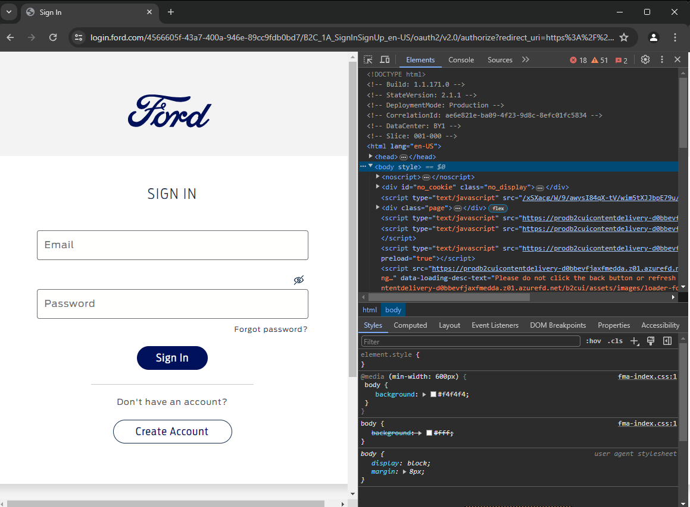
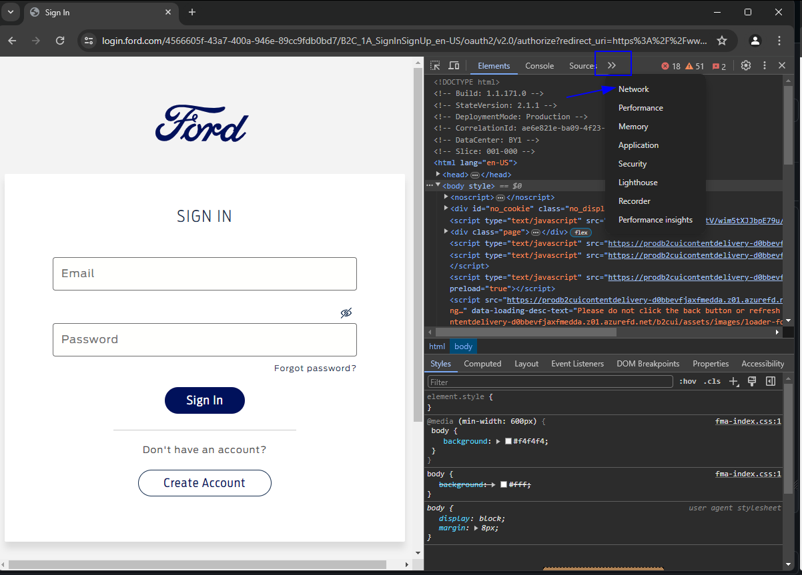
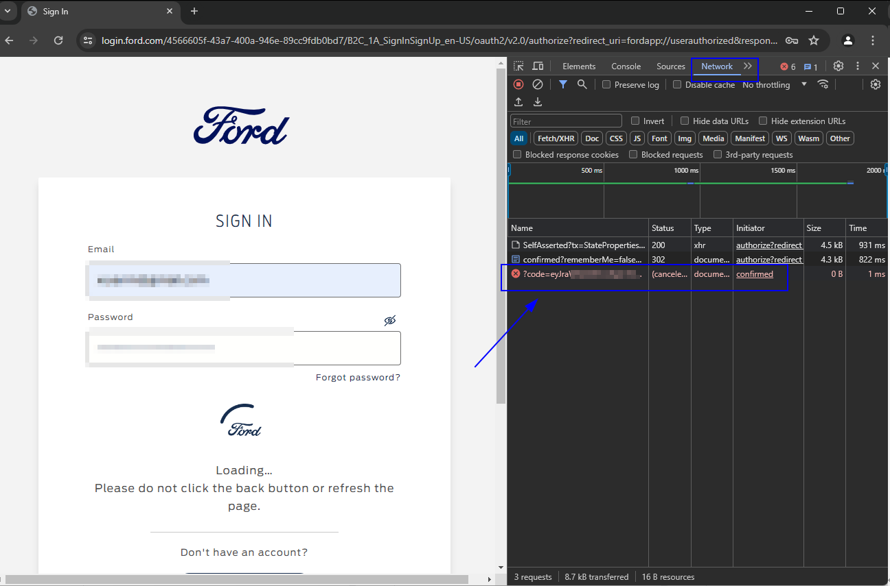
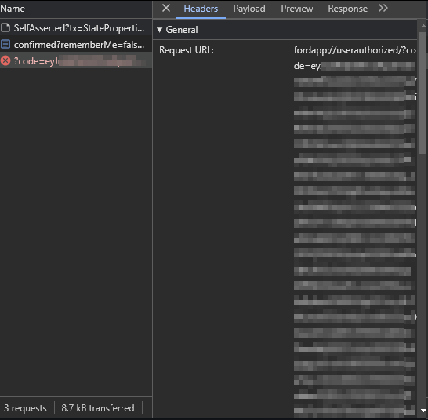
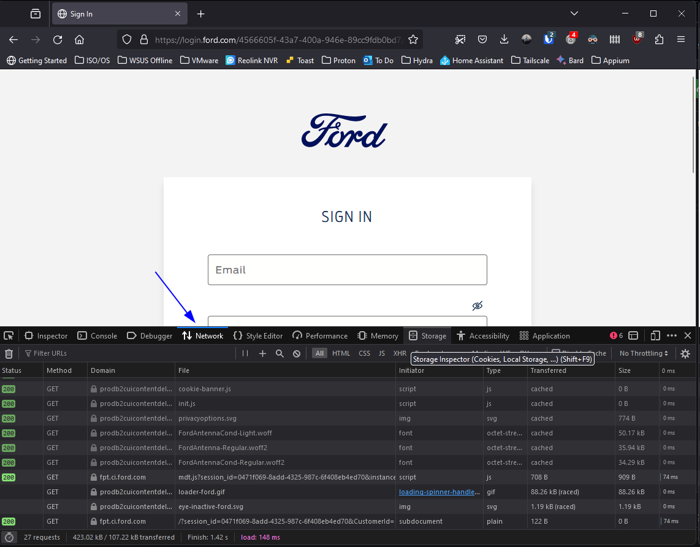
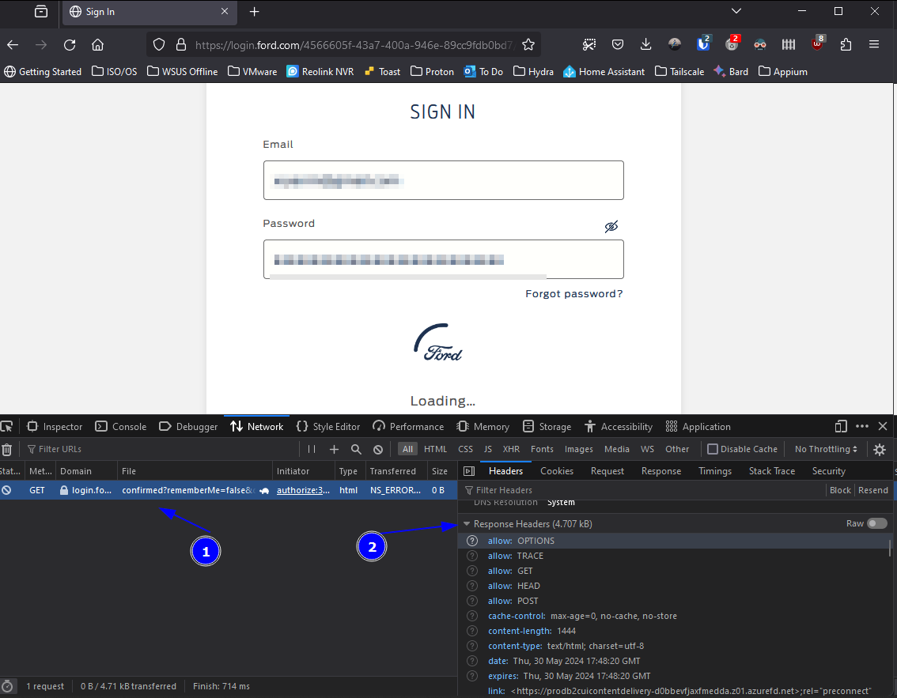
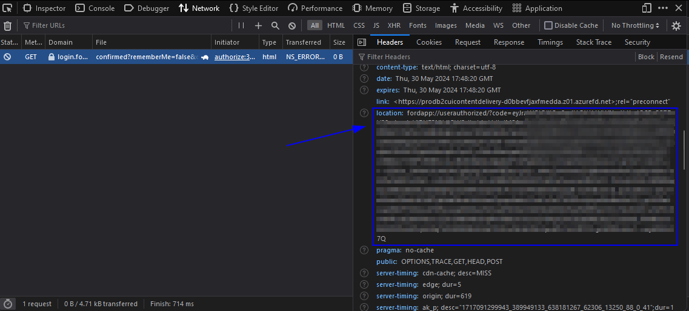

## Chromium Based (Chrome / Edge) 

❗Photos are taken in Google Chrome. Edge will look different but the same steps apply

> [!NOTE]
> It is recommended to disable any ad-blockers or extensions that might interfere with this process.  
Alternatively, you can use a private window.

### **Step 1:**
1. Open developer tools by pressing F12 on the keyboard
2. Navigate to the URL provided through HomeAssistant

### **Step 2:**
1. Enter your credentials to login to Ford with the developer tools opened
   > If developer tools are not expanded, ensure you are on the network section.  

2. Press *Sign In*
   > The spinning circle will not load, this is normal. It is at this point you will obtain your token
3. Under the network tab look for an item starting with `?code=`

4. Select the `?code=` item within the `Name` box
   > A new window will open displaying the headers

5. Select **the entire string** and copy it to the clipboard.
   > Ctrl + C
6. Proceed with installation.

***

## Firefox

> [!NOTE]
> It is recommended to disable any ad-blockers or extensions that might interfere with this process. Alternatively, you can use a private window.  
Users have also reported issues using Firefox specifically.  
**If you're having trouble using Firefox it is recommended to try using a Chromium based browser.**

#### **Step 1:**
1. Open developer tools by pressing F12 on the keyboard
2. Navigate to the URL provided through HomeAssistant

#### **Step 2:**
1. Enter your credentials to login to Ford with the developer tools opened
2. Press *Sign In*
3. Now navigate to the Network tab within your browser's developer tools and search for an entry (likely only one exists), which is starts with `?conmfirmed`. and then click on this item.
   > This will open a new section

<table><tr><td></td></tr></table>

4. In the `Headers` tab, scroll down until you find `Response Headers` (Item 2 in the photo below)

<table><tr><td></td></tr></table>

5. Find the `Location` section (Item 3 in the photo) and "__Copy Value__" via the context menu.

<table><tr><td></td></tr></table>

6. Proceed with installation
