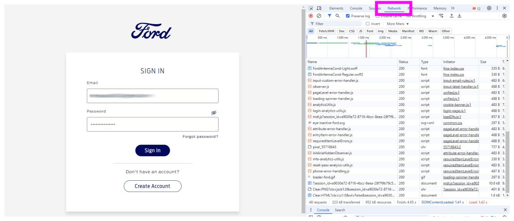
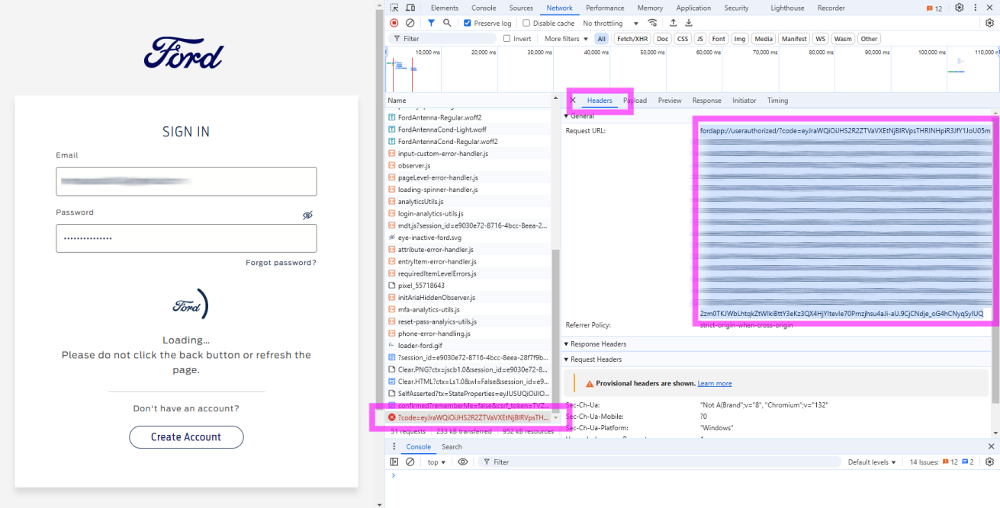

# Half-manual Login Flow
### This method does require some manual steps, **including the usage of the developer tools!** of your browser (running on a Desktop/Laptop - using a mobile device will __not__ work!)

> [!WARNING]
> Although this has been tested multiple times (in January–June 2025 and re-tested in January 2026), It can't be guaranteed the method will last as Ford is consistently making changes!

> [!NOTE]
> This process requires [at least the 2025.10.2 version](https://github.com/marq24/ha-fordpass/releases/tag/2025.10.2) of this fordpass integration.


### **Step I:**
1. In Home Assistant: Enter your Fordpass username
2. You should select your region (where you have registered your FordPass account).


### **Step II:**
1. Copy the URL that has been generated and paste it in your additional/separate browser. You might like to use a private/incognito window for this.

> [!IMPORTANT]
> You must do this on a Destop/Laptop browser that has Developer tools available. __Do NOT try__ to do this with your __tablet or phone__.
> 
> Ensure you have enabled the Developer tools before pressing "log in" as you will be required to capture a header once logged in!
> - [:link: Chromium based dev tools helper (Chrome / Edge)](./DEV-TOOLS.md)
>
> As _an alternative_, you might also like to use Firefox - but the capturing of the URL works slightly different than described here – please refer to the Firefox specific instructions.:
> - [:link: Firefox dev tools helper](./DEV-TOOLS.md#firefox)


2. In your second/separate browser (where you paste the URL), the Ford Login dialog should be displayed.<br/><br/>

3. __IMPORTANT__: Now open the developer Tools of your desktop/laptop browser and select the __Network__ tab as the active view.

   __Windows/Linux:__
   
      - Press __F12__, or
         - Right-click anywhere on the page → __"Inspect"__, or
         - Press __Ctrl+Shift+I__

   __Mac:__
   
      - Press __Cmd+Option+I__, or
         - Right-click anywhere on the page → __"Inspect Element"__

   <br/>A panel will appear at the bottom or side of your browser window.
   
   <br/>__Find the Network Tab__

      1. Look at the top of the developer tools panel
      2. Click on the __"Network"__ tab
         - It might be between other tabs like "Elements", "Console", "Sources"
   <br/><br/>
 
4. Enter your FordPass credentials and click `Sign In`.
> [!NOTE]
> After you have pressed the login button, the Ford Login website will just show a spinner and will not continue to load — this is the intended behavior! At this point you are able to obtain the code by using the browser tools (see next step 4).



5. Now look into the `Network tab` of the Browsers developer tools you just have opened in step 3. In the following the Chrome/Egde method is described – for Firefox please refer to the Firefox specific instructions linked above]
   
   - The last request (probably already showed in red) is the one we are interested in... Since this last request contains the code we must capture for the integration.
   - Do a right-click on that line that should start with `code?=...` (in the _Name_ Column)
   - From the context menu select __Copy >__ (which will open another sub-menu)
   - From the sub-menu select __Copy URL__
    
   - The copied content should look similar to the following string, starting with `fordapp://` (or `lincolnapp://`):
   - ```fordapp://userauthorized/?code=eyJraWQiOiItSm9pdi1OX1ktUWNsa***************************```
   - **Ensure you capture the entire string (copy the raw output and not the wrapped text)**
   - You then can close the Ford login browser window 

> [!NOTE]
> Again - the Ford login website will not __fully loaded__. The login page will just continue to spin. 




### **Step III:** 
- Once you've entered the full token request URL token back in the home assistant integration setup dialog, the integration should go off and get you a new set of tokens and then ask what vehicles you want to add.