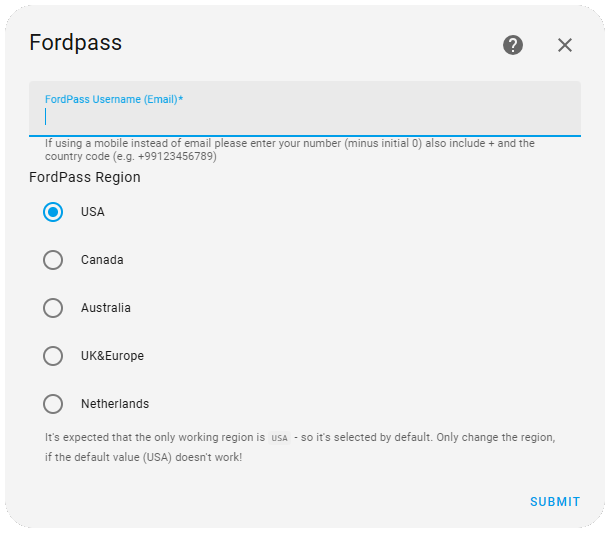
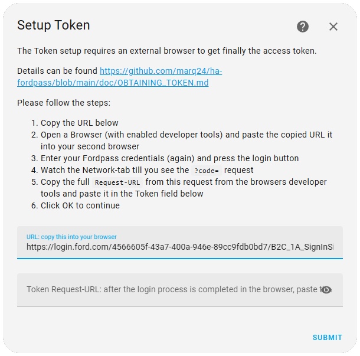
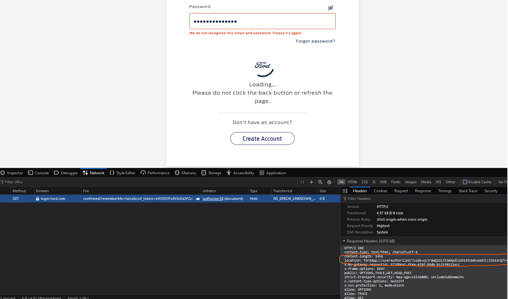

# New Login Flow
## This new method does require some manual input, **including using browser tools!**

> [!WARNING]
> Although this have tested this locally, It can't be guaranteed the method will last as Ford are consistently making changes!

> [!NOTE]
> This requires the [1.70 release](https://github.com/marq24/ha-fordpass/releases/tag/1.70-Release) as this has not been fully detected you will need to manually grab the files to test

### **Step 1:**
1. In Home Assistant: Enter your Fordpass username and choose the region you are from




### **Step 2:**
1. Copy the URL that has been generated and visit it in your browser. 

> [!IMPORTANT]
> Ensure you have Developer tools enabled before pressing "log in" as you will be required to capture a header once logged in!  
[:link: Chromium based dev tools helper (Chrome / Edge)](./DEV-TOOLS.md)  
[:link: Firefox dev tools helper](./DEV-TOOLS.md#firefox)




2. Log in to your Ford account

3. Using the browser tools select the `Network tab` of the web console and view the headers section.
   - You are looking for the contents of the "Location Header" as shown in the pic below
     > (Make sure you copy the raw output and not the wrapped text)
   - The output should look similar to the following string, starting with `fordapp://`:
   - ```fordapp://userauthorized/?code=eyJraWQiOiItSm9pdi1OX1ktUWNsa***************************```
  - **Ensure you capture the entire string and enter it into the text box.**

> [!NOTE]
> The website will not fully load. The login page will just continue to spin. It is at this point you are able to obtain the code by using the browser tools.




### **Step 3:** 
- Once you've entered the token, the integration should go off and get you a new set of tokens and then ask what vehicles you want to add. 


